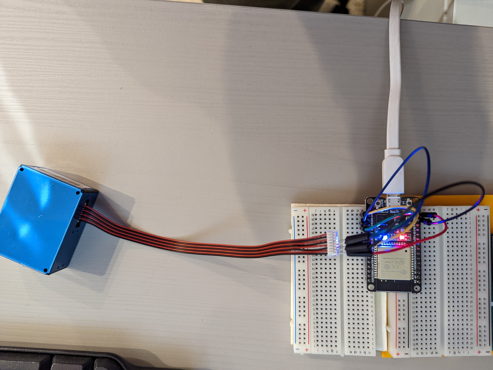

# Particulate Matter Sensor

This build is based on a blog entry at [pieterbrinkman.com](https://www.pieterbrinkman.com/2021/02/03/build-a-cheap-air-quality-meter-using-esphome-home-assistant-and-a-particulate-matter-sensor/)

## Whats needed

1. The sensor - [PMS5003](http://www.aqmd.gov/docs/default-source/aq-spec/resources-page/plantower-pms5003-manual_v2-3.pdf). This sensor is readily supported by [ESPHome config](https://esphome.io/components/sensor/pmsx003.html)
2. ESP32 board

## Connections


| PMS PIN | PURPOSE | ESP32 PIN |
|---------|--------|------------|
| 1   | Vcc        | VCC        |
| 2   | GND        | GND        |
| 3   | SET        | 3V3        |
| 4   | RX         | GPIO15     |
| 5   | TX         | GPIO2      |



## Configuration

**Note**
The [configuration](esp32dev1.yaml) stores secrtets in `secrets.yaml`, not included in this repo:
```
wifi_ssid: <REDACTED>
wifi_password: <REDACTED>
ap_ssid: <REDACTED>
ap_password: <REDACTED>
api_password: <REDACTED>
```


Configuration overview:
```
uart:
  tx_pin: GPIO15
  rx_pin: GPIO2
  baud_rate: 9600

sensor:
  - platform: pmsx003
    type: PMSX003
    pm_1_0:
      name: "Particulate Matter <1.0µm Concentration"
    pm_2_5:
      name: "Particulate Matter <2.5µm Concentration"
    pm_10_0:
      name: "Particulate Matter <10.0µm Concentration"
    update_interval: 20s
```

**Note**
To extend the lifespan of the sensor, it makes sense to powercycle it as described in the [blog](https://www.pieterbrinkman.com/2021/02/03/build-a-cheap-air-quality-meter-using-esphome-home-assistant-and-a-particulate-matter-sensor/). I've used this instead of update interval.

## Integration with HomeAssistant

The advantage of ESPHome is that HomeAssistant's ESPHome integration detects this device right away and imports the entities without any extra configs.
